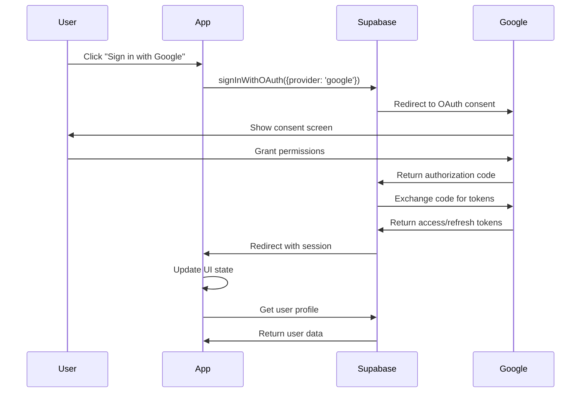

# Design Document

## Overview

This design implements Google OAuth authentication for the GlassList shopping list application using Supabase's built-in OAuth providers. The solution integrates seamlessly with the existing authentication system while providing users with a convenient single sign-on option through their Google accounts.

The implementation leverages Supabase's OAuth capabilities to handle the complex OAuth flow, token management, and user profile synchronization, ensuring security best practices are followed throughout.

## Architecture

### Authentication Flow Architecture



### System Integration

The Google OAuth integration will extend the existing authentication system without disrupting current functionality:

- **Supabase Auth**: Handles OAuth flow, token management, and session persistence
- **Profile Management**: Syncs Google profile data with existing user profiles
- **Demo Mode**: Maintains compatibility with existing demo mode functionality
- **RLS Policies**: Works seamlessly with existing Row Level Security policies

## Components and Interfaces

### 1. OAuth Configuration

**Supabase Dashboard Configuration:**
- Enable Google OAuth provider in Supabase dashboard
- Configure OAuth redirect URLs for development and production
- Set up Google Cloud Console project with OAuth credentials

**Environment Variables:**
```typescript
// No additional environment variables needed
// Supabase handles OAuth configuration through dashboard
```

### 2. Authentication Service Extensions

**Enhanced Auth Functions:**
```typescript
// New function in src/lib/supabase/auth.ts
export async function signInWithGoogle() {
  const { data, error } = await supabase.auth.signInWithOAuth({
    provider: 'google',
    options: {
      redirectTo: `${window.location.origin}/dashboard`,
      queryParams: {
        access_type: 'offline',
        prompt: 'consent',
      }
    }
  })
  return { data, error }
}

// Enhanced profile sync function
export async function syncGoogleProfile(user: User) {
  const googleProfile = {
    full_name: user.user_metadata.full_name || user.user_metadata.name,
    avatar_url: user.user_metadata.avatar_url || user.user_metadata.picture,
    email: user.email
  }
  
  return updateProfile(user.id, googleProfile)
}
```

### 3. UI Components

**Google Sign-In Button:**
```typescript
interface GoogleSignInButtonProps {
  isLoading?: boolean
  onSignIn: () => Promise<void>
  className?: string
}

// Component will display Google branding and handle click events
```

**Enhanced Auth Page:**
- Add Google sign-in button to existing auth form
- Maintain current email/password functionality
- Show appropriate loading states during OAuth flow
- Handle OAuth errors gracefully

### 4. Session Management

**OAuth Session Handling:**
```typescript
// Enhanced session management in auth.ts
export async function handleOAuthCallback() {
  const { data: { session }, error } = await supabase.auth.getSession()
  
  if (session?.user && session.user.app_metadata.provider === 'google') {
    await syncGoogleProfile(session.user)
  }
  
  return { session, error }
}
```

## Data Models

### User Profile Extensions

The existing `profiles` table will accommodate Google OAuth users without schema changes:

```sql
-- Existing profile structure supports Google data
profiles {
  id: uuid (matches Supabase auth.users.id)
  email: string (from Google account)
  full_name: string (from Google profile)
  avatar_url: string (from Google profile picture)
  -- existing fields remain unchanged
}
```

### OAuth Provider Metadata

Supabase automatically stores OAuth provider information in `auth.users`:

```typescript
// Available in user.app_metadata
{
  provider: 'google',
  providers: ['google']
}

// Available in user.user_metadata
{
  avatar_url: string,
  email: string,
  email_verified: boolean,
  full_name: string,
  iss: string,
  name: string,
  picture: string,
  provider_id: string,
  sub: string
}
```

## Error Handling

### OAuth Flow Errors

**Error Categories:**
1. **User Cancellation**: User cancels OAuth consent
2. **Network Errors**: Connection issues during OAuth flow
3. **Configuration Errors**: Invalid OAuth setup
4. **Account Conflicts**: Google account already linked to different user

**Error Handling Strategy:**
```typescript
export async function handleGoogleSignInError(error: AuthError) {
  switch (error.message) {
    case 'User cancelled OAuth':
      return 'Sign-in was cancelled. Please try again.'
    case 'OAuth provider error':
      return 'Unable to connect to Google. Please try again later.'
    case 'Email already registered':
      return 'This Google account is already associated with another user.'
    default:
      return 'An error occurred during sign-in. Please try again.'
  }
}
```

### Fallback Mechanisms

- Maintain email/password authentication as fallback
- Graceful degradation when OAuth is unavailable
- Clear error messages with actionable next steps
- Demo mode compatibility preserved

## Testing Strategy

### Unit Tests

**Authentication Functions:**
```typescript
describe('Google OAuth Authentication', () => {
  test('signInWithGoogle initiates OAuth flow', async () => {
    // Test OAuth initiation
  })
  
  test('syncGoogleProfile updates user profile', async () => {
    // Test profile synchronization
  })
  
  test('handleOAuthCallback processes session', async () => {
    // Test callback handling
  })
})
```

### Integration Tests

**OAuth Flow Testing:**
- Test complete OAuth flow in development environment
- Verify profile data synchronization
- Test error scenarios (cancelled auth, network failures)
- Validate session persistence across page reloads

**Compatibility Testing:**
- Ensure existing email/password auth continues working
- Verify demo mode functionality is preserved
- Test RLS policies work with OAuth users
- Validate existing user data remains accessible

### Manual Testing Scenarios

1. **New User Flow**: Sign up with Google account
2. **Existing User Flow**: Link Google account to existing profile
3. **Error Scenarios**: Test various failure modes
4. **Cross-Device**: Test session persistence across devices
5. **Profile Sync**: Verify Google profile data updates

## Security Considerations

### OAuth Security

- **HTTPS Only**: All OAuth flows use secure HTTPS connections
- **State Parameter**: Supabase handles CSRF protection automatically
- **Token Storage**: Secure token storage handled by Supabase
- **Scope Limitation**: Request minimal necessary Google permissions

### Data Privacy

- **Profile Data**: Only request essential profile information
- **Token Management**: Refresh tokens stored securely by Supabase
- **User Consent**: Clear consent flow for data access
- **Data Retention**: Follow existing data retention policies

### Integration Security

- **RLS Compatibility**: OAuth users subject to same RLS policies
- **Session Management**: Consistent session handling across auth methods
- **Profile Validation**: Validate and sanitize Google profile data
- **Error Information**: Avoid exposing sensitive error details

## Implementation Phases

### Phase 1: Core OAuth Integration
- Configure Google OAuth in Supabase dashboard
- Implement basic Google sign-in functionality
- Add Google sign-in button to auth page
- Handle OAuth callback and session creation

### Phase 2: Profile Synchronization
- Implement Google profile data sync
- Handle profile updates from Google
- Add account linking functionality for existing users
- Test profile data consistency

### Phase 3: Error Handling & Polish
- Implement comprehensive error handling
- Add loading states and user feedback
- Test edge cases and error scenarios
- Optimize user experience flow

### Phase 4: Testing & Deployment
- Comprehensive testing across all scenarios
- Performance optimization
- Security audit
- Production deployment with monitoring